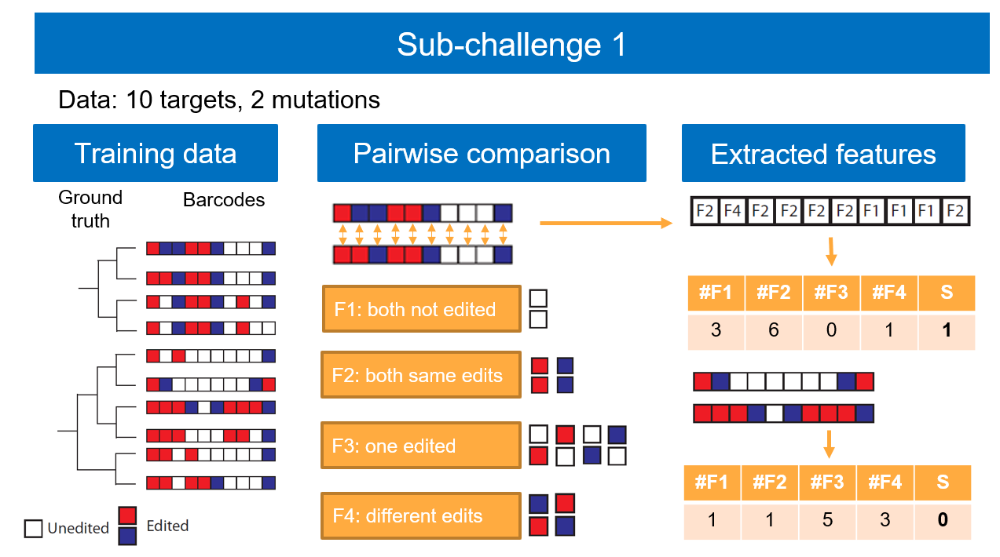
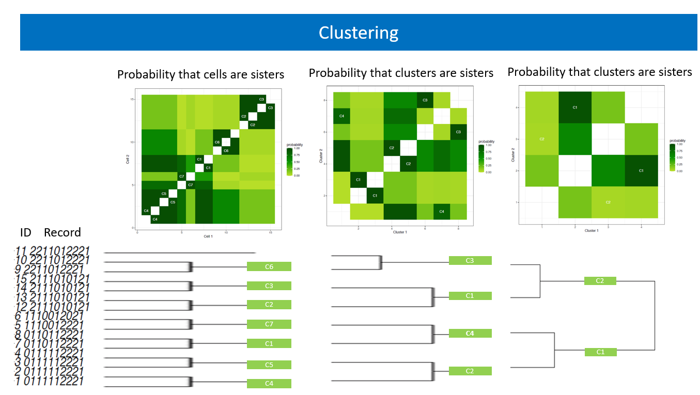

# Using Machine Learning (ML) for cell lineage reconstruction
Renata Retkute (rr614@cam.ac.uk), Alidivinas Prusokas and Augustinas Prusokas

This is team AMbeRland submission to Allen Institute Cell Lineage Reconstruction DREAM Challenge https://www.synapse.org/#!Synapse:syn20692755/wiki/

## ML set up
We used  Generalized Boosted Regression (GBR)  model to predict the probabilities that two cells are sisters, and custom clustering algorithm, to partition cells into lineages based on these probabilities.  

As a predictors, we have chosen the following features based on pairwise comparison of each recording array position:
- number of recorded units which have not mutated;
- number of recorded units which have  the same mutation;
- number of recorded units which have  single mutation;
- number of recorded units which have different mutations. 

The status  was set to 1 if two cells were sister cells and to 0 if observed two cells were not sister cells. We included only those pairs with status 0, that have not already been included with status 1.  We assumed only binary trees.

Figure 1. AMbeRland approach for learning features from the DREAM Challenge training data.

All calculations were performed in R using package gbm https://cran.r-project.org/web/packages/gbm/index.html.
Following options were used to train Generalized Boosted Regression model:
- distribution = "bernoulli",
-  n.trees = 100,
-  interaction.depth = 1,
-  n.minobsinnode = 3,
-  cv.folds = 5.

## Clustering
 The clustering starts at the lowest tree level, where all possible pairs of cells are ranked according to the predicted probability that they are sisters. At each consecutive level, pairwise comparison is performed between each lower level cluster by calculating the maximum probability between any elements of two clusters. Pairs of clusters are ordered again according to this probability and are assumed to have the same parent-node if it’s value is above the estimated threshold for this level. This process was repeated until one or two clusters were left.

Figure 2. AMbeRland approach for clustetering cells based on predicted probabilities that cells are sister cells.

During the tree construction, the ground truth was used to evaluate a set of decreasing thresholds corresponding to how any two individual clusters of cells were related at different levels of the lineage tree.

## Usage
To reproduce AMbeRland's submission for Subchallenge 1:

    Rscript run.R

By default, the code will use fitted model. To fit the model based on training data, change:

      use.trained.model<-FALSE
    
To write results into spreadsheet, change:

      write.results.to.file<-TRUE

 To explore influence of threshold values, run:
        
        Rscript thresholds.R
 
 This will calculate distribution and mean of the Robinson-Foulds distance and the triplets distance for training data for a given threshold. 
